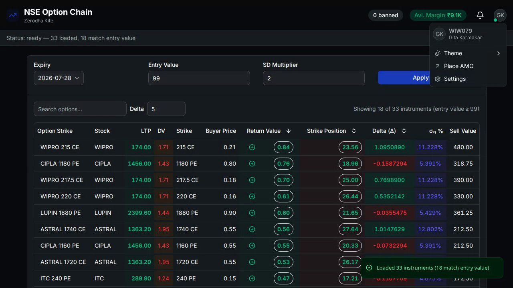

# NSE Option Chain

Real-time NSE F&O option chain dashboard for ~200 stocks, powered by [Zerodha Kite](https://kite.trade/). The server selects strikes via asymmetric sigma bounds, streams live bids over Kite's ticker websocket, computes delta/returns/margins using **NSE trading-minute** math, pushes alerts, and serves a React SPA for chain monitoring, order placement, and ban management.

**All broker I/O runs server-side** — the browser never talks to Kite directly.

## Features

- **Live option chain** — bid, sell value, return %, delta, sigma metrics, margin status, underlying gain/loss
- **Asymmetric sigma strike selection** — CE ceiling / PE floor with configurable SD multiplier
- **Intraday-aware time math** — sigma and delta use NSE market minutes (9:15–15:30 IST), not calendar days
- **Sortable table** — sort by return value, strike position, delta; search by strike
- **Real-time notifications** — order-trigger alerts (when return % crosses `orderPercent`) and top-bid changes; toast + sound + history sheet
- **Option sell orders** — NFO MIS SELL LIMIT from the chain table with depth view and margin check
- **AMO buy orders** — laddered CNC equity buys on `/amo` (regular or AMO per row)
- **Ban management** — auto-fetched NSE F&O ban list + persistent custom bans; banned symbols excluded from chain load
- **Dark mode** — light / dark / system theme toggle
- **Batch margin lookups** — Kite `orderMargins` with rate limiting
- **SQLite instrument catalog** — Kite instruments + NSE volatility, holiday-aware market-minute math
- **Typed Hono RPC + WebSocket** — real-time chain, status, and notification stream

## Demo

Load the chain with SD multiplier 2, switch theme, and open the sell order modal from the return column.

<div align="center">

[](https://github.com/anurag-roy/all-option-chain/blob/main/docs/demo/demo.mp4)

▶ **[Watch demo video](https://github.com/anurag-roy/all-option-chain/blob/main/docs/demo/demo.mp4)** · [Download MP4](docs/demo/demo.mp4)

</div>

## Tech stack

| Layer | Stack |
|-------|-------|
| Server | TypeScript, Hono, `@hono/node-server`, `@hono/node-ws` |
| Client | React 19, Vite 8, TanStack Router, TanStack Table & Query, Tailwind v4 |
| RPC | `hono/client` typed RPC |
| Database | Drizzle ORM + SQLite (`@libsql/client`) |
| Broker | `kiteconnect-ts` (REST + `KiteTicker` websocket) |

## Prerequisites

- Node.js 20+
- A [Zerodha Kite](https://kite.trade/) account with API access (API key + secret)
- For automated login: TOTP secret configured in `.env`

## Quick start

```bash
# Clone and install
git clone https://github.com/anurag-roy/all-option-chain.git
cd all-option-chain
npm install

# Configure environment
cp .env.example .env
# Edit .env with your Kite credentials

# Initialize database
npm run db:push
npm run db:seed

# Authenticate with Kite (writes .data/accessToken.txt)
npm run login
# Or, with TOTP configured:
npm run auto-login

# Development — run in two terminals
npm run dev          # API + WebSocket on :4000 (or PORT from .env)
npm run dev:client   # Vite dev server on :5173 (proxies /api → server)
```

Open [http://localhost:5173](http://localhost:5173), pick an expiry, and load the chain.

> **Note:** `client/vite.config.ts` proxies `/api` to port `3000` by default. Set `PORT=3000` in `.env`, or update the proxy target to match your server port (default `4000`).

### Production

```bash
npm run build   # builds client → client/dist
npm start       # Hono serves the SPA + API on PORT
```

## Pages

| Route | Purpose |
|-------|---------|
| `/` | Option chain — filter form + live sortable table |
| `/amo` | AMO laddered equity buy orders |
| `/settings` | NSE + custom stock ban management |

## Environment variables

Copy `.env.example` to `.env` and fill in:

| Variable | Description |
|----------|-------------|
| `PORT` | HTTP server port (default `4000`) |
| `DATABASE_URL` | SQLite path (default `file:.data/database.db`) |
| `KITE_API_KEY` | Kite Connect API key |
| `KITE_API_SECRET` | Kite Connect API secret |
| `KITE_USER_ID` | Zerodha user ID (for login scripts) |
| `KITE_PASSWORD` | Zerodha password (for login scripts) |
| `KITE_TOTP_SECRET` | TOTP secret (for `auto-login`) |

The Kite access token is written to `.data/accessToken.txt` by the login scripts and read at server startup. If missing, the server starts but live market data will not work.

**Do not commit** `.env`, `.data/accessToken.txt`, or `.data/database.db`.

## Scripts

| Command | Purpose |
|---------|---------|
| `npm run dev` | Start API + WebSocket server with hot reload |
| `npm run dev:client` | Start Vite dev server |
| `npm run build` | Install deps + build client for production |
| `npm start` | Run production server |
| `npm run login` | Interactive Kite login |
| `npm run auto-login` | TOTP-based Kite login |
| `npm run db:push` | Push Drizzle schema to SQLite |
| `npm run db:migrate` | Run Drizzle migrations |
| `npm run db:generate` | Generate Drizzle migration |
| `npm run db:seed` | Seed instruments, volatility, and holidays |
| `npm run data:prepare` | `db:migrate` + `db:seed` |
| `npm run db:studio` | Open Drizzle Studio |
| `npm run typecheck` | Typecheck server |
| `npm run format` | Prettier on server + client |

## Architecture

```
React SPA ──HTTP (Hono RPC)──► Hono API (/api/*)
React SPA ◄──WebSocket────────► /api/ws
                                    │
                                    ▼
                          ClientBroadcaster
                                    │
                                    ▼
                        OptionChainCoordinator
                         ├── InstrumentCatalog (DB)
                         ├── SubscriptionPlanner (sigma strikes)
                         ├── MarketMinutesCache (T/N for sigma + delta)
                         ├── BansService (NSE + custom bans)
                         ├── Kite REST (quotes, margins, orders)
                         ├── MarketDataService (KiteTicker)
                         ├── MarginBook (cached margins)
                         └── calculators/ (delta, sigma, returns)
```

### Market minutes

Sigma bounds and Black-Scholes delta use **NSE trading minutes**, not working days:

- **Session:** 9:15 AM – 3:30 PM IST (375 minutes per full trading day)
- **Skipped:** weekends and NSE holidays (from `holidays` table, seeded via `.data/nse_holidays.csv`)
- **`T`** — market minutes in the last year (cached at startup)
- **`N`** — market minutes from now until expiry (60s cache TTL; decays during the session)
- **Delta** uses year fraction `N / T`; sigma formulas use `sqrt(T / N)` as before

### API endpoints

| Method | Path | Purpose |
|--------|------|---------|
| GET | `/api/user` | Kite profile |
| GET | `/api/user/margin` | Account net margin |
| GET | `/api/chain/status` | Engine status + row counts |
| GET | `/api/chain/expiries` | Upcoming option expiry dates |
| GET | `/api/chain/symbols` | All equity names in DB |
| GET | `/api/chain/equities` | Equity tradingsymbols (AMO combobox) |
| POST | `/api/chain/filter` | Apply filter and load chain |
| GET | `/api/bans` | NSE + custom banned stocks |
| POST | `/api/bans/toggle` | Toggle custom ban `{ name }` |
| GET | `/api/orders/quote` | Bid/ask depth for an instrument |
| POST | `/api/orders/margin` | Margin for a single sell order |
| POST | `/api/orders/sell` | Place NFO MIS SELL LIMIT order |
| POST | `/api/orders/amo` | Batch CNC BUY orders (regular or AMO) |
| WS | `/api/ws` | Live chain + status + notifications |

### Chain filter

```typescript
{
  expiry: string;        // ISO date, e.g. "2026-06-26"
  sdMultiplier: number;  // default 1
  entryValue: number;    // default 99 — client-side display filter only
  orderPercent: number;  // default 0.5 — server-side order-trigger alert threshold
  symbols?: string[];    // optional subset
}
```

### WebSocket

**Client → server:** `subscribe`, `unsubscribe`, `updateFilter`, `updateSdMultiplier`

**Server → client:** `optionChain`, `status`, `sdMultiplierUpdated`, `notification`

Notifications fire when a row's return % crosses `orderPercent` (with margin ready) or when the top-return row's bid changes. Important alerts play a sound and show a toast.

## Project structure

```
├── .env / .env.example
├── .data/
│   ├── accessToken.txt     # Kite token (gitignored)
│   ├── database.db         # SQLite (gitignored)
│   └── nse_holidays.csv
├── server/
│   ├── index.ts            # Bootstrap
│   ├── app.ts              # Hono routes + WebSocket
│   ├── db/                 # Drizzle schema
│   ├── routes/             # user, chain, orders, bans
│   ├── lib/
│   │   ├── calculators/    # delta, sigma, returns
│   │   ├── market-minutes.ts       # NSE session minute math
│   │   └── services/       # coordinator, kite, market-data, market-minutes-cache, bans, etc.
│   ├── shared/             # Zod schemas, types, config, amo helper
│   └── scripts/            # seed, login, build
└── client/
    └── src/
        ├── routes/         # /, /amo, /settings
        └── components/     # chain table, orders, bans, notifications
```

## Tips & gotchas

1. **Entry value filter is client-side.** The server sends all rows; the table filters where `sellValue >= entryValue`. Default `99` hides most rows when markets are closed (bids at 0). Lower to `0` to see data off-hours.

2. **OI filter is server-side.** Contracts with zero open interest are dropped before subscription.

3. **Banned symbols are auto-excluded.** NSE daily bans are fetched once per IST day; custom bans persist until removed. Both are applied server-side in `applyFilter`.

4. **`orderPercent` drives alerts.** It is not just a display setting — the server uses it for order-trigger notifications.

5. **Expiry format.** The database stores ISO dates (`YYYY-MM-DD`). Do not mix with legacy `MAR-2026` style strings.

6. **Avoid duplicate filter calls.** The filter form uses HTTP POST; the WebSocket also supports `updateFilter`. Don't trigger both for the same action.

7. **Rate limits.** Quote, margin, and order requests are queued (`p-queue`). Don't remove these queues.

8. **Vite proxy port.** Ensure the dev proxy target matches your server `PORT` (see Quick start note).

9. **Sigma/delta shift intraday.** `minutesTillExpiry` decreases during market hours (refreshed every 60s), so bounds and delta update through the session.

## Development

```bash
npm run typecheck              # server TypeScript
cd client && npm run typecheck # client TypeScript
cd client && npm run build     # client production build
npm run format                 # Prettier
```

For deeper architecture notes, service internals, and contributor guidelines, see [AGENTS.md](./AGENTS.md).

## License

MIT © [Anurag Roy](https://anuragroy.dev)
